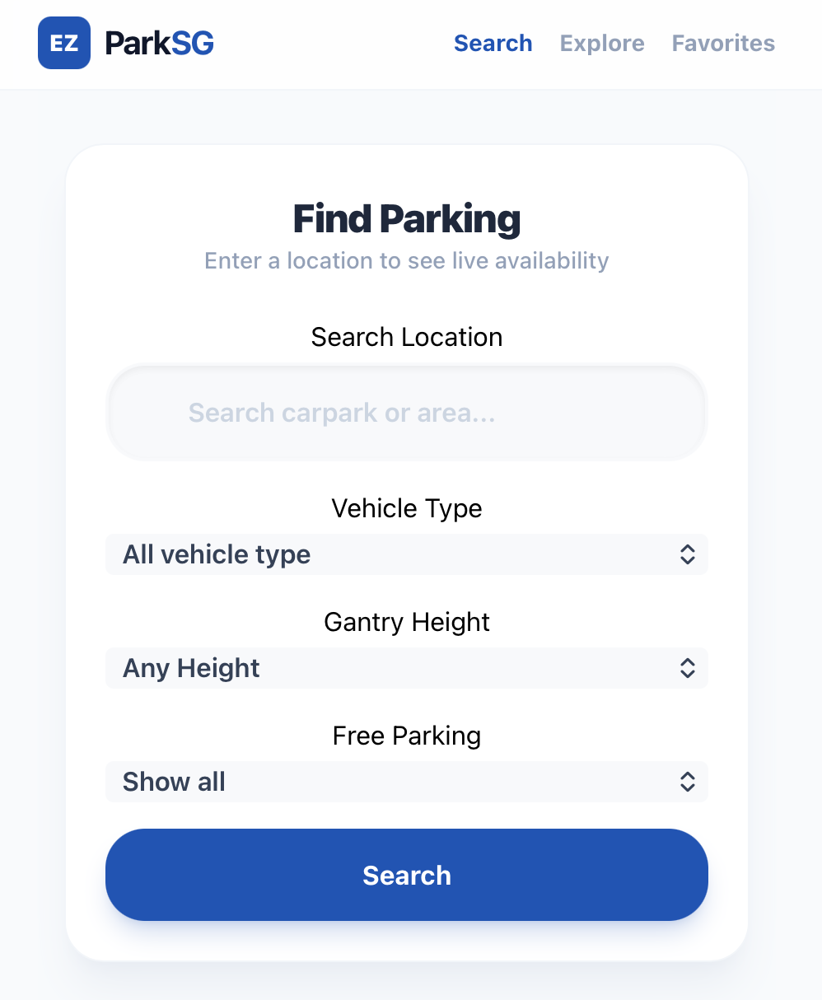
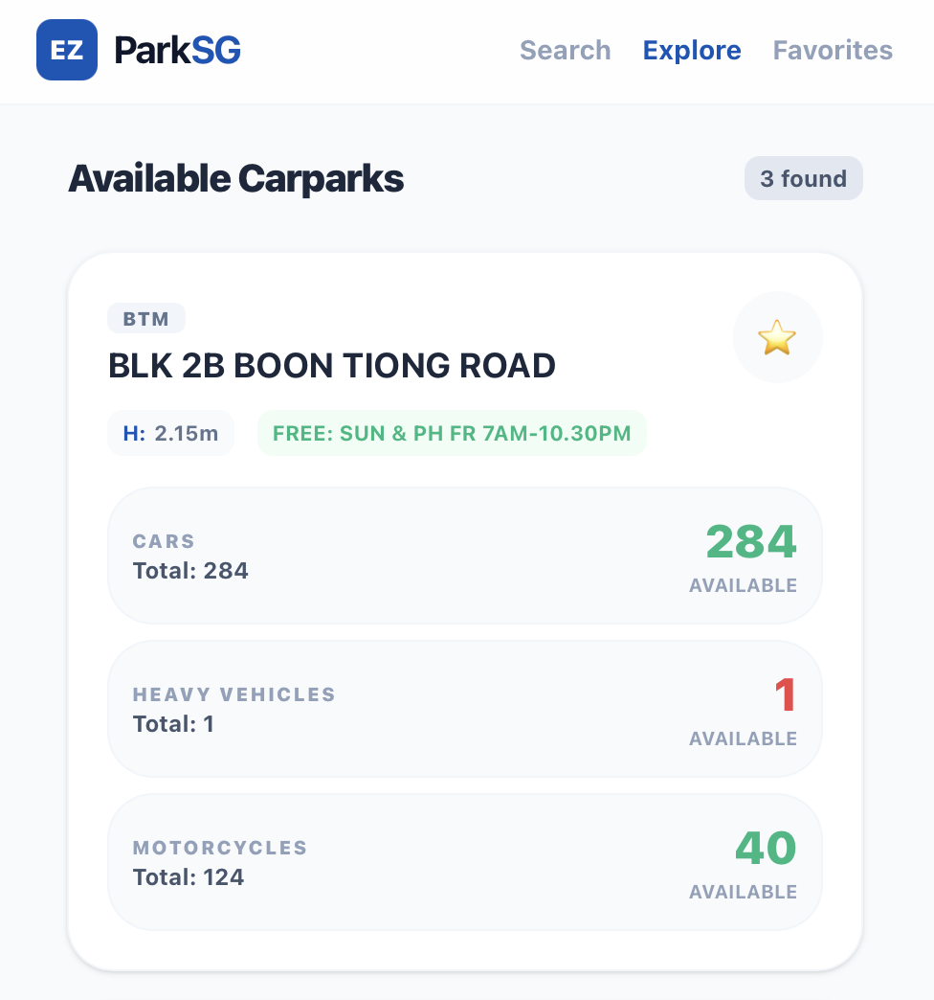
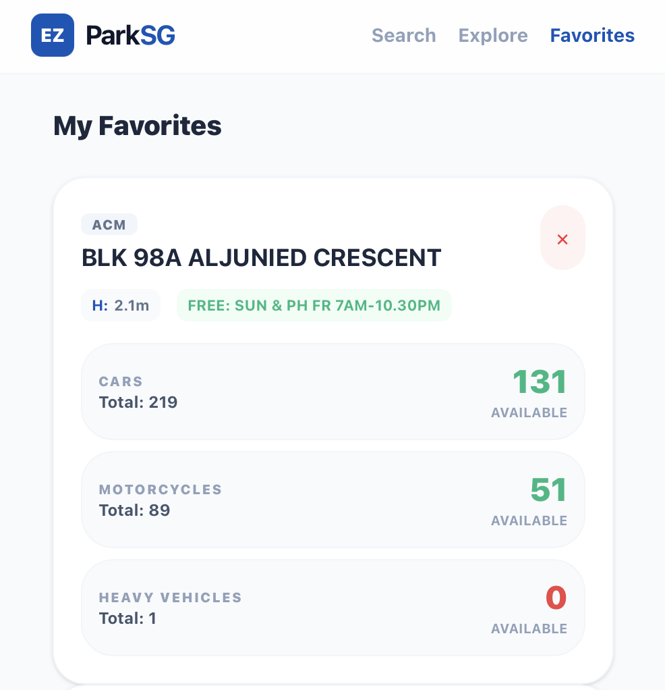

# 🚗 EZ-Park SG

EZ-Park SG simplifies the hunt for HDB parking lots by providing live availability, gantry height clearance, and fee structure.

## 🔗 Live Deployment
You can access the live version here:
https://ez-park-sg.netlify.app

## ✨ Features
- Live Lot Tracking: Real-time data fetching from Data.gov.sg for HDB carpark availability.
- Smart Search: Search by street name or postal code.
- Lot Search Filters:
  - Vehicle types: Filter by Car, Motocycle, Motocycle with side car, Heavy Vehicle.
  - Gantry Height: Avoild "low-ceiling" scares for taller vehicles.
  - Parking Fee: Search for free parking (Sundays/ Public Holidays).
Favorites: Save your most visited carparks for quick access.

## 🛠️ Tech Stack
Frontend: React
External APIs: Data.gov.sg Carpark Availability
Database: Airtable (Used for storing user favorite carparks)
Styling: Tailwind CSS

## 📸 Screenshots
| Search Screen | Filtered Carparks | Favorite Carparks |
| :---: | :---: | :---: |
| | | |
